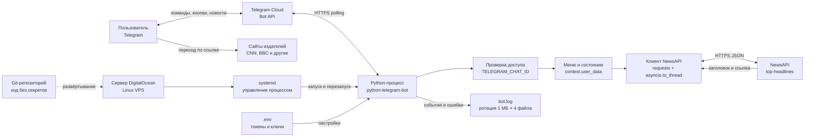

# USA News Bot

Персональный Telegram-бот на Python для получения свежих новостей через NewsAPI.

Пользователь выбирает конкретный источник либо категорию американских новостей. Бот запрашивает последние публикации, извлекает заголовок, источник и ссылку, после чего отправляет каждую статью отдельным сообщением в Telegram.

## Возможности

- выбор конкретного новостного источника;
- выбор категории американских новостей;
- получение последних шести публикаций;
- отправка заголовка, источника и ссылки в Telegram;
- ограничение доступа по `TELEGRAM_CHAT_ID`;
- обработка сетевых ошибок, ошибок NewsAPI и пустых результатов;
- неблокирующее выполнение запроса NewsAPI;
- журналирование с автоматической ротацией файлов.

## Архитектура экосистемы



## Как проходит запрос

1. Пользователь отправляет `/start` в Telegram.
2. Telegram Bot API передаёт обновление процессу бота через long polling.
3. Бот сравнивает текущий `chat_id` с `TELEGRAM_CHAT_ID` из `.env`.
4. Пользователь выбирает источник либо категорию.
5. Выбор сохраняется в памяти в `context.user_data`.
6. После нажатия «Получить новости» бот формирует запрос к NewsAPI.
7. Синхронный вызов `requests.get()` выполняется через `asyncio.to_thread()`, поэтому интерфейс бота не блокируется.
8. NewsAPI возвращает JSON со статьями.
9. Бот проверяет HTTP-статус, внутренний статус NewsAPI и наличие статей.
10. Заголовок, источник и ссылка отправляются пользователю через Telegram Bot API.
11. При ошибке пользователь получает понятное сообщение, а технические подробности записываются в журнал.

При выборе категории используются американские источники:

```text
country=us
category=technology
```

При выборе конкретного канала используется его идентификатор:

```text
sources=cnn
```

Параметры `sources` и `category` одновременно не используются из-за ограничений NewsAPI.

## Взаимодействующие компоненты

- **Telegram-клиент** — интерфейс пользователя.
- **Telegram Bot API** — передаёт команды боту и доставляет сообщения.
- **Python-приложение** — обрабатывает команды, кнопки, состояние и ошибки.
- **NewsAPI** — возвращает новости в формате JSON.
- **Сайты издателей** — открываются по ссылкам из сообщений; полный текст может быть платным.
- **`.env`** — хранит API-ключ, токен Telegram и разрешённый `chat_id`.
- **Git** — хранит код и документацию без секретов и журналов.
- **Linux VPS** — обеспечивает круглосуточную работу.
- **systemd** — запускает бота после перезагрузки и перезапускает после сбоя.

## Структура проекта

```text
F_3_Bot_News/
├── assets/              # Изображения проекта
├── tools/               # Вспомогательные тестовые скрипты
├── .env                 # Секреты, не добавляется в Git
├── .env.example         # Безопасный шаблон настроек
├── .gitignore           # Исключения Git
├── main.py              # Основной код бота
├── README.md            # Документация
└── requirements.txt     # Закреплённые зависимости Python
```

## Локальная установка Windows

```powershell
cd D:\F_3_Projects_Python\F_3_Bot_News
python -m venv .venv
.venv\Scripts\Activate.ps1
python -m pip install -r requirements.txt
```

## Настройка

Скопируйте `.env.example` в `.env` и заполните значения:

```env
NEWS_API_KEY=ваш_ключ_NewsAPI
TELEGRAM_BOT_TOKEN=токен_от_BotFather
TELEGRAM_CHAT_ID=ваш_идентификатор_чата
```

Не публикуйте `.env`, API-ключ NewsAPI и токен Telegram. Если токен попал в журнал, Git или на скриншот, немедленно отзовите его через `@BotFather`.

## Локальный запуск

```powershell
.venv\Scripts\Activate.ps1
python main.py
```

Остановить бота можно сочетанием `Ctrl+C`. Пока используется локальный компьютер, бот работает только при запущенном процессе.

## Развёртывание на Linux VPS

Рекомендуемая серверная схема: отдельный каталог, отдельное виртуальное окружение и отдельная служба `systemd`. Бот использует исходящие HTTPS-соединения, поэтому для polling не требуется открывать новый входящий порт в firewall.

Пример расположения:

```text
/opt/usa-news-bot/
├── .venv/
├── .env
├── main.py
└── requirements.txt
```

Пример службы `/etc/systemd/system/usa-news-bot.service`:

```ini
[Unit]
Description=USA News Telegram Bot
After=network-online.target
Wants=network-online.target

[Service]
Type=simple
User=newsbot
WorkingDirectory=/opt/usa-news-bot
ExecStart=/opt/usa-news-bot/.venv/bin/python /opt/usa-news-bot/main.py
Restart=on-failure
RestartSec=5
NoNewPrivileges=true
PrivateTmp=true

[Install]
WantedBy=multi-user.target
```

Команды управления службой:

```bash
sudo systemctl daemon-reload
sudo systemctl enable --now usa-news-bot
sudo systemctl status usa-news-bot
sudo journalctl -u usa-news-bot -f
```

Если на VPS уже работают другие сервисы, включая VPN, бот размещается отдельно и не меняет их конфигурацию, контейнеры или порты.

## Журналирование

События пишутся в терминал и `bot.log`. После достижения 1 МБ создаются резервные файлы `bot.log.1`, `bot.log.2` и `bot.log.3`. Все журналы исключены из Git. Успешные HTTP-запросы библиотеки `httpx` скрыты, чтобы URL с токеном Telegram не попадали в журнал.

## Безопасность

- доступ разрешён только значению `TELEGRAM_CHAT_ID`;
- `.env`, `.venv` и журналы исключены из Git;
- `.env.example` не содержит секретных значений;
- зависимости закреплены по версиям;
- запросы имеют тайм-аут;
- ошибки API проверяются и журналируются;
- для работы через polling не нужен входящий сетевой порт;
- на сервере `.env` рекомендуется защитить командой `chmod 600 .env`.

## Ограничения

- новости отправляются только после нажатия кнопки;
- выбранные настройки хранятся в памяти и сбрасываются после перезапуска;
- NewsAPI предоставляет метаданные и ссылки, но не гарантирует бесплатный полный текст;
- доступность источников зависит от NewsAPI и тарифа;
- приложение рассчитано на одного разрешённого пользователя;
- автоматическое расписание публикаций пока не реализовано.
